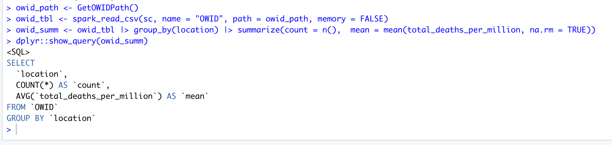
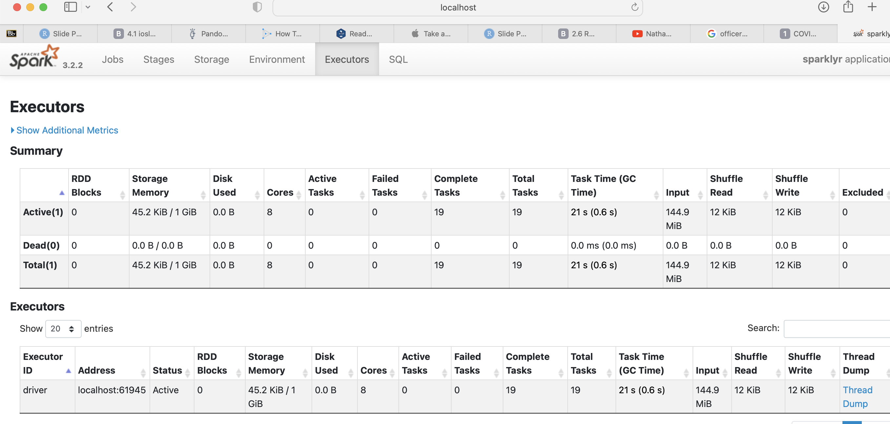
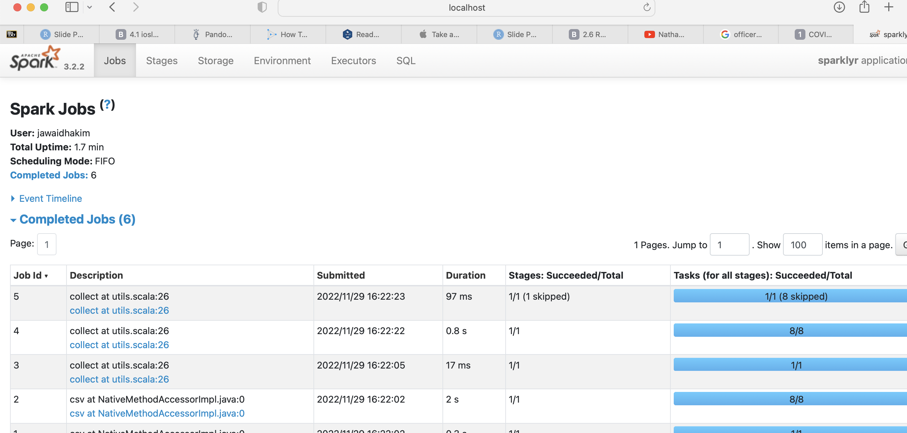

```{r include=FALSE}
library(tidyverse)
library(GGally) #to plot ggpairs
library(hrbrthemes)
library(knitr)
```

# Motivation

-   Use COVID-19 datasets to explore global pandemic stats

-   Explore relationships between COVID-19 prevalence and other datasets, e.g. mask policies, S&P500

# Data Acquisition - JHU CSSE [USA Daily Data](https://github.com/CSSEGISandData/COVID-19/tree/master/csse_covid_19_data/csse_covid_19_daily_reports_us)


# Data Acquisition - JHU CSSE [Global timeseries](https://github.com/CSSEGISandData/COVID-19/tree/master/csse_covid_19_data/csse_covid_19_time_series)


# Data Acquisition - [Our World In Data](https://ourworldindata.org/coronavirus)


# Data Wrangling - Strategy

-   Common data extraction scripts/functions across datasets

    -   Parallel processing

    -   Table extraction (scraping) from HTML using Selenium/readr

    -   Spark cluster interface

# Data Wrangling Milestones

-   Github API [rate limits](https://docs.github.com/en/rest/overview/resources-in-the-rest-api#rate-limiting). Implemented [OAuth authentication](https://docs.github.com/en/developers/apps/building-oauth-apps/authorizing-oauth-apps) to access Github via a personal account for higher limits.

-   OWID dataset did not provide latitude/longitude variables. Downloaded a separate dataset with country lat/long and (left) joined with OWID for plotting on map

# Shiny - interactive data exploration


[Click to launch Shiny App](https://jhakim.shinyapps.io/owid-covid/)

# Leaflet - interactive map visualization


# Spark - distributed (Scalable) query, analytics, ML







# Tech Stack

-   **Rselenium**: headless browser for getting around embedded JavaScript
-   **parallel**: chosen for efficiently processing remote data files using a local cluster
-   **readr**: reading remote/local CSVs
-   **Leaflet**: interactive global map
-   **Spark/sparklr**: proof-of-concept Spark cluster. Cloud hosted Spark services are fee-based or time-limited - used local cluster
-   **AWS S3**: AWS S3 rate-limits made it impractical (20,000 GET Requests; 2,000 PUT, COPY, POST, or LIST Requests each month)

# Exploratory Data Analysis

# Combining the Covid and Mask Policy datasets


# Combining the Covid and Mask Policy datasets (cont'd)


# Face Covering Dataset

Source: <https://ourworldindata.org/covid-face-coverings>

Countries are grouped into five categories:

0 = No policy  
1 = Recommended  
2 = Required in some specified shared/public spaces outside the home with other people present, or some situations when social distancing not possible  
3 = Required in all shared/public spaces outside the home with other people present or all situations when social distancing not possible  
4 = Required outside the home at all times regardless of location or presence of other people  

# Face Covering Dataset (cont'd)

-   Aggregate - does not account for intra-country dynamics

-   Mask policy is typically in response to Covid outbreaks

# Avg. Mask Rates - Continent


# Avg. Mask Rates - G7


# Excess Deaths by Avg. Mask Policy


# Excess Deaths by Mask Policy


# Statistical Analysis

Does average mask policy predict total excess mortality?

The null hypothesis, $H_0$ - average mask policy *does not* predict total excess mortality.

The alternative hypothesis, $H_A$ - average mask policy *does* predict total mortality.

# Relationship Between Mask Policy and Excess Death


# Fitting in a Linear Model


# Interpreting the Model

- p-value = 0.0264, significance
- Adjusted R-squared = 0.037, accounts for very little variance

# Residuals


# Residuals (cont'd)


# Residuals (cont'd)

- Linear
- Non-Normal Distribution
- Does Not Satisfy Homostedacticity (Non-Similar Variances)

# Conclusion

- Relationship exists
- Not meaningful enough to predict
- Possible reasons

# Thank You!
