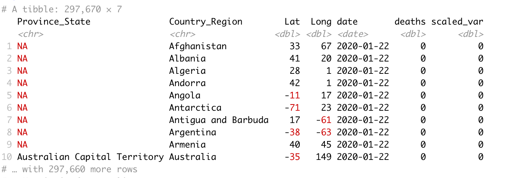

# Motivation

- Use COVID-19 datasets to explore global pandemic stats

- Explore relationships between COVID-19 prevalence and other datasets, e.g. mask policies, S&P500

# Data Acquisition - JHU CSSE [USA Daily Data](https://github.com/CSSEGISandData/COVID-19/tree/master/csse_covid_19_data/csse_covid_19_daily_reports_us)

# Data Acquisition - JHU CSSE [Global timeseries](https://github.com/CSSEGISandData/COVID-19/tree/master/csse_covid_19_data/csse_covid_19_time_series)

# Data Acquisition - [Our World In Data](https://ourworldindata.org/coronavirus) 

# Data Wrangling - Parallel Processing

- Common data extraction scripts/functions across datasets

    - Parallel processing
    
    - Table extraction (scraping) from HTML using Selenium/readr
    
    - Spark cluster interface

# Data Wrangling - Hurdles

- Github API [rate limits](https://docs.github.com/en/rest/overview/resources-in-the-rest-api#rate-limiting). Implemented [OAuth authentication](https://docs.github.com/en/developers/apps/building-oauth-apps/authorizing-oauth-apps) to access Github via a personal account for higher limits.

- OWID dataset did not provide latitude/longitude variables which would be handy for map plots. Downloaded a separate dataset with country lat/long and (left-)joined with OWID for plotting on

# Data Exploration - Interactive exploration using Shiny

# Data Exploration - Interactive gerographic exploration using Leaflet

# Data Analytics - Spark

# Tech Stack

- **Rselenium**: headless browser capability to solve for embedded JavaScript
- **parallel**: efficient processing of datsets using local cluster
- **readr**: reading remote/local CSVs
- **leaflet**: rendering interactive global map
- **Spark/sparklr**: proof-of-concept for EDAs on large datasets. Cloud hosted Spark services are either fee-based or time-limited so used a local cluster
- **AWS S3**: explored storagestoring datasets on AWS/S3. However, S3 storage rate-limits made this impractical (20,000 GET Requests; 2,000 PUT, COPY, POST, or LIST Requests each month)
